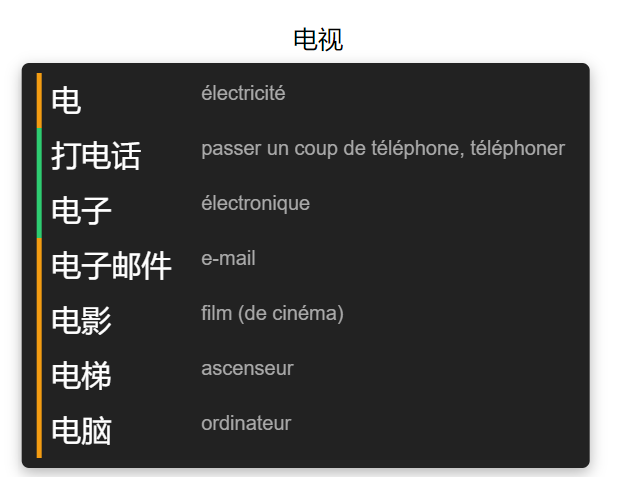

# cn-links

**cn-links** est un add-on pour **Anki**, en partie vibe-codé. Il facilite l'apprentissage du chinois en créant des liens entre les caractères et les mots de son vocabulaire.

Pendant la révision d'une carte, **cn-links** affiche un popup au survol de chaque caractère du mot. Ce popup présente d'autres mots de votre collection qui utilisent ce caractère, ainsi que leur traduction et leur niveau d'apprentissage.



## Fonctionnalités

- Affiche un popup au survol de chaque caractère chinois.
- Recherche les mots contenant le caractère dans les paquets Anki configurés.
- Affiche le mot et sa traduction.
- Indique le niveau d'apprentissage avec une couleur :
    - 🟢 Mature
    - 🟠 En apprentissage
    - 🔴 Nouveau
- Affiche le caractère seul en priorité lorsqu'il existe comme carte.
- Évite les doublons entre plusieurs paquets grâce à un système de priorité.

##  Configuration

La configuration se fait depuis :

**Anki → Outils → Modules complémentaires → cn-links → Config**

## Paquets

Les paquets dans lesquels effectuer la recherche sont définis avec une priorité :

```json
{
    "decks": {
        "chinois": 1,
        "chinese": 2
    }
}
```

Le nombre indique la priorité du paquet : plus le nombre est petit, plus le paquet est prioritaire.

Par exemple, si un mot existe dans les deux paquets :

```
chinois → priorité 1
chinese → priorité 2
```

Seule la carte de `chinois` sera affichée.

Cela permet d'éviter les doublons lorsque plusieurs paquets contiennent le même vocabulaire.

## Champs

Les champs utilisés pour la recherche et l'affichage peuvent également être configurés :

```json
{
    "hanzi_field": "Hanzi",
    "translation_field": "Traduction"
}
```

`hanzi_field` correspond au champ contenant le mot chinois.
`translation_field` correspond au champ contenant sa traduction.

## Installation

### Depuis AnkiWeb

Cet add-on n'est pas encore disponible sur Anki web.

### Depuis les sources

Téléchargez ou clonez le dossier `cn_links` du projet dans le dossier des modules complémentaires d'Anki :

```
%APPDATA%\Anki2\addons21\
```

Redémarrez Anki après l'installation.

## Développement

Le projet est développé en **Python** et **JavaScript**.

Le code Python est exécuté par l'environnement Python embarqué dans Anki. Un environnement virtuel peut être utilisé séparément pour le développement, notamment pour `mypy` et l'autocomplétion.

Pendant le développement, un lien symbolique peut être utilisé entre le dossier du projet et le dossier `addons21` afin d'éviter de copier les fichiers à chaque modification.

## Structure du projet
```
cn_links/
├── __init__.py
├── reviewer.py
├── search.py
├── config.json
└── web/
    ├── hover.js
    └── hover.css
```

## Compatibilité

Développé et testé avec :

- Anki 25.09.5
- Python 3.13
- Qt 6

La compatibilité avec d'autres versions d'Anki n'est pas garantie.
